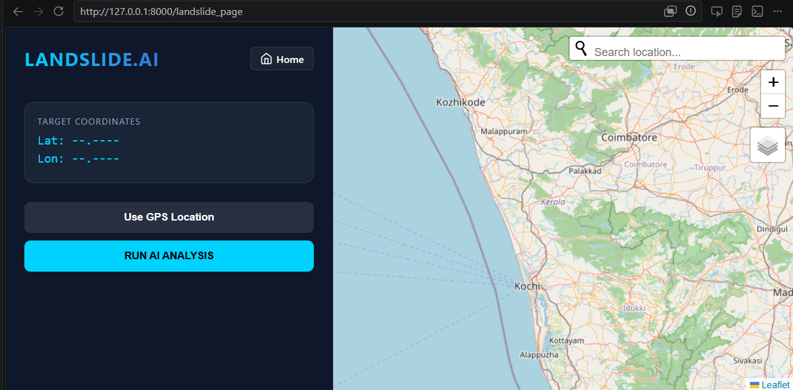
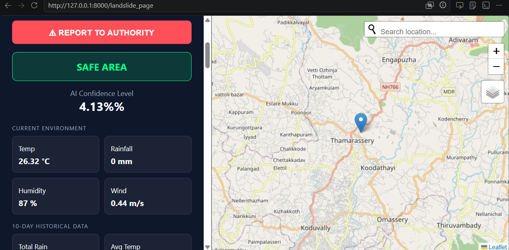

# 🌍 Landslide Prediction System

<p align="center">
  
  
  
  
</p>

> **ML-based system to predict landslide risk using satellite images and real-time weather data.**

---

## 📌 About the Project

Landslides are one of the most destructive natural disasters, especially in hilly and coastal regions. This system uses a **Convolutional Neural Network (CNN)** trained on satellite imagery to detect and predict landslide-prone areas, integrated with a **Django web application** for real-time risk assessment.

---

## ✨ Features

- 🛰️ Satellite image-based landslide risk detection using CNN
- 🌦️ Real-time weather data integration
- 🌐 Django web interface for prediction and visualization
- 📊 Risk level output (High / Medium / Low)
- 🗺️ Location-based analysis

---

## 🖼️ Screenshots

> Add your screenshots inside a `screenshots/` folder and update the paths below.

| Home Page | Prediction Result |
|-----------|------------------|
|  |  |

---

## 🏗️ Project Structure

```
Landslide-Prediction-System/
├── myapp/                  # Django app (views, models, urls)
├── templates/              # HTML templates
├── static/                 # CSS, JS, images
├── models/                 # Model architecture (weights hosted externally)
├── requirements.txt        # Python dependencies
├── manage.py               # Django entry point
└── README.md
```

---

## ⚙️ Setup & Installation

### Prerequisites
- Python 3.10+
- pip
- Git

### Steps

```bash
# 1. Clone the repo
git clone https://github.com/ABHISHEKTU/Landslide-Prediction-System.git
cd Landslide-Prediction-System

# 2. Create virtual environment
python -m venv venv
source venv/bin/activate        # Linux/Mac
venv\Scripts\activate           # Windows

# 3. Install dependencies
pip install -r requirements.txt

# 4. Download model weights
# See "Model Weights" section below

# 5. Run the Django server
python manage.py migrate
python manage.py runserver
```

Open `http://127.0.0.1:8000` in your browser.

---

## 🧠 Model

- **Architecture**: Convolutional Neural Network (CNN)
- **Input**: Satellite images
- **Output**: Landslide risk prediction (High / Medium / Low)
- **Framework**: TensorFlow / Keras

### 📦 Download Model Weights

> Model weights are not included in this repo due to file size.

Download from: **[Google Drive / Hugging Face link here]**

Place downloaded file at: `models/landslide_model.h5`

---

## 📡 Dataset

> Dataset used for training is not included due to size constraints.

- Source: [Add dataset source — e.g., NASA, Bhuvan, Kaggle]
- Type: Satellite imagery + weather features

---

## 🛠️ Tech Stack

| Layer | Technology |
|-------|-----------|
| Frontend | HTML, CSS, JavaScript |
| Backend | Django (Python) |
| ML Model | CNN (TensorFlow/Keras) |
| Data | Satellite images, Weather API |

---

## 👨‍💻 Author

**Abhishek T U**
- GitHub: [@ABHISHEKTU](https://github.com/ABHISHEKTU)

---

## 📄 License

This project is for academic purposes. All rights reserved.

---

<p align="center">Made with ❤️ for academic submission</p>
